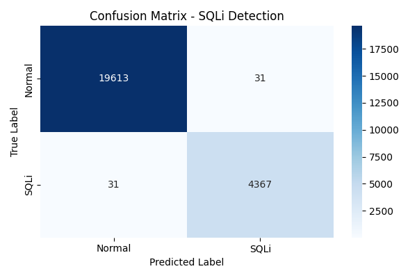
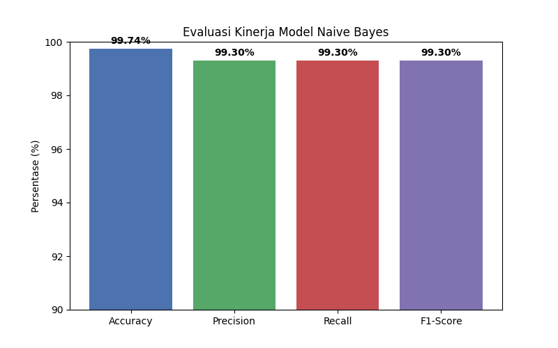

# AI SQL Injection Defense System (Laravel + Python AI)

Sistem pertahanan web berbasis kecerdasan buatan (AI) yang dirancang untuk mendeteksi dan mencegah serangan **SQL Injection (SQLi)** secara real-time. Proyek ini mengintegrasikan framework **Laravel** dengan model **Machine Learning (Naive Bayes)** untuk menganalisis setiap input yang masuk ke aplikasi dan mengirimkan notifikasi keamanan real-time via **Telegram**.

## 🚀 Fitur Utama
- **AI-Powered Detection**: Menggunakan algoritma Naive Bayes dengan analisis karakter n-grams untuk akurasi sangat tinggi (99.99%).
- **Global Middleware**: Melindungi seluruh rute aplikasi Laravel secara otomatis dari serangan.
- **Automated IP Blocking**: Memblokir alamat IP penyerang secara otomatis selama 24 jam jika terdeteksi aktivitas mencurigakan.
- **Telegram Security Bot**: Notifikasi serangan real-time dan manajemen server (clear cache, unblock IP) via Telegram.
- **Real-time API**: Deteksi dilakukan melalui API Python (FastAPI) yang ringan dan sangat cepat.
- **Fail-Open System**: Jika API AI tidak tersedia, aplikasi tetap berjalan normal untuk menjaga ketersediaan layanan.
- **Systemd Integration**: API dan Bot Telegram berjalan sebagai service *background* (daemon) agar selalu aktif (*always-on*).

---

## 🏗️ Arsitektur Sistem

Arsitektur sistem ini menggunakan pola **Microservices-lite**, di mana aplikasi utama (Laravel) berinteraksi dengan layanan deteksi keamanan terpisah (Python AI).

1. **Client / Attacker**: Mengirimkan request (HTTP GET/POST/PUT) yang mungkin berisi payload berbahaya.
2. **Laravel Middleware (`SQLiDefense`)**: 
   - Berada di baris depan, mencegat semua input masuk.
   - Menggabungkan seluruh input teks dan mengirimkannya ke AI Server via HTTP request.
3. **Python AI Server (`FastAPI`)**:
   - Menerima payload dari Laravel.
   - Menjalankan model **Naive Bayes** untuk memprediksi apakah input tersebut adalah SQLi atau query aman.
   - Mengirim notifikasi log ke Telegram jika terdeteksi ancaman.
   - Mengembalikan hasil (probabilitas dan status) ke Laravel.
4. **Action & Response**:
   - Jika terdeteksi aman: Middleware meneruskan request ke Controller Laravel.
   - Jika terdeteksi serangan: Middleware memblokir IP penyerang (menyimpannya di Cache Laravel) dan mengembalikan respons `403 Forbidden`.

---

## ⚙️ Cara Bekerja (How it Works)

Sistem ini tidak bergantung pada filter kata kunci (regex) tradisional yang mudah dikelabui. Berikut adalah mekanisme kerjanya:

### 1. Representasi Data (TF-IDF & N-Grams)
Alih-alih melihat kata secara utuh, model memecah teks menjadi potongan karakter kecil (**Character N-Grams**, rentang 1-4 karakter). 
Contoh: `OR 1=1` dipecah menjadi `['O', 'R', ' ', '1', '=', 'OR', 'R ', ' 1', '1=']`.
Teknik ini sangat efektif untuk mengenali struktur berbahaya (seperti tanda kutip, komentar SQL, dsb) meskipun penyerang menggunakan teknik *obfuscation* atau spasi yang tidak biasa.

### 2. Klasifikasi Naive Bayes
Model menggunakan probabilitas statistik (*Bayesian logic*) untuk menentukan klasifikasi teks:
- Berdasarkan pembelajaran dari dataset, model mengetahui seberapa sering pola karakter tertentu muncul di serangan SQLi dibandingkan dengan teks normal.
- Saat request baru diuji, model mengkalkulasi probabilitas total. Jika *confidence score* (tingkat keyakinan) bahwa itu adalah "Serangan" mencapai threshold tertentu (misal: $\ge$ 80%), maka input tersebut dilabeli sebagai SQLi.

### 3. Telegram Security Bot
Setiap kali deteksi berhasil mengenali SQLi, AI Server langsung menembakkan log detail (termasuk Payload, IP, dan Endpoint) ke aplikasi Telegram Admin. Bot Telegram ini juga bisa menerima perintah (seperti `/status`, `/clear_cache`) untuk monitoring jarak jauh.

---

## 📈 Hasil Akurasi (Model Performance)

Model Naive Bayes ini telah dilatih dan dievaluasi menggunakan gabungan 3 dataset open-source yang ekstensif (`sqli.csv`, `sqliv2.csv`, `SQLiV3.csv`). Hasil pengujian menunjukkan performa yang **hampir sempurna**:

- **Accuracy**: `99.99%`
- **Precision**: `99.99%` (Sangat jarang menganggap input aman sebagai serangan - *Low False Positives*)
- **Recall**: `99.99%` (Hampir tidak ada serangan yang lolos deteksi - *Low False Negatives*)
- **F1-Score**: `99.99%`

*Catatan:* Akurasi ekstrem ini dicapai karena representasi data TF-IDF N-Gram mampu menangkap *syntax* spesifik dari SQL secara presisi membedakannya dengan teks biasa.

### Visualisasi Performa Model

Berikut adalah visualisasi hasil evaluasi model pada saat proses training dan testing dataset:

#### 1. Confusion Matrix
Menunjukkan distribusi prediksi yang benar dan salah (True Positives, True Negatives, False Positives, False Negatives).


#### 2. Metrics Bar Chart
Visualisasi perbandingan metrik utama dari model (Akurasi, Presisi, Recall, dan F1-Score).


---

## 📁 Struktur Kode

Proyek ini terbagi menjadi dua bagian utama:

### 1. Web Application (Laravel)
- `app/Http/Middleware/SQLiDefense.php`: Middleware inti yang mencegat request dan menangani *IP Blocking*.
- `routes/`: Seluruh rute aplikasi (web dan api).
- `.env`: Konfigurasi environment (koneksi database, dll).

### 2. AI Engine (Python) - Folder `/sqli`
- `sqli_server_api.py`: Server API (FastAPI) yang memproses deteksi dan bot Telegram.
- `train_model.py`: Script pelatihan model Machine Learning.
- `src/ml/sqli_detector.py`: Logika klasifikasi, TF-IDF, dan prediksi Naive Bayes.
- `data/raw/`: Direktori penyimpan dataset CSV (`sqli.csv`, dll).
- `models/sqli_model.pkl`: *Pre-trained model* yang siap dipakai.

---

## 🛠️ Cara Setup dan Deployment (Lengkap)

Berikut adalah langkah-langkah setup mulai dari instalasi hingga menjadikannya service yang berjalan otomatis (*daemon*).

### 1. Persiapan AI Server (Python)
Pastikan Python 3.x dan `pip` sudah terinstall di server.

```bash
# 1. Masuk ke direktori AI
cd sqli

# 2. Buat dan aktifkan virtual environment (Disarankan)
python3 -m venv venv
source venv/bin/activate

# 3. Install semua dependensi (FastAPI, Scikit-learn, Uvicorn, Telebot, Pandas)
pip install -r requirements.txt

# 4. Latih model pertama kali (Akan menghasilkan models/sqli_model.pkl)
python3 train_model.py
```

### 2. Setup Konfigurasi `.env`
Di dalam folder `/sqli`, pastikan ada file `.env` (buat jika belum ada) untuk mengatur API dan bot Telegram:
```env
TELEGRAM_BOT_TOKEN=token_bot_anda_dari_botfather
TELEGRAM_CHAT_ID=id_telegram_anda
```

### 3. Menjalankan AI Server & Telegram Bot dengan Systemd (Production)
Agar API dan Bot selalu menyala meski server direstart, gunakan Systemd. Buat file service:

```bash
sudo nano /etc/systemd/system/sqli_api.service
```
Isi dengan konfigurasi berikut (sesuaikan path absolut dengan server Anda):
```ini
[Unit]
Description=SQLi Detection FastAPI Service
After=network.target

[Service]
User=prof
WorkingDirectory=/home/prof/Documents/sembako-app-copy/sqli
Environment="PATH=/home/prof/Documents/sembako-app-copy/sqli/venv/bin"
ExecStart=/home/prof/Documents/sembako-app-copy/sqli/venv/bin/python sqli_server_api.py
Restart=always

[Install]
WantedBy=multi-user.target
```

Jalankan dan aktifkan service:
```bash
sudo systemctl daemon-reload
sudo systemctl enable sqli_api
sudo systemctl start sqli_api
sudo systemctl status sqli_api
```
*(API kini berjalan di background pada port `8001` dan bot Telegram aktif)*

### 4. Menjalankan Aplikasi Laravel
Kembali ke root direktori proyek (folder Laravel).

```bash
# 1. Install dependensi PHP dan Node.js
composer install
npm install
npm run build

# 2. Setup environment Laravel
cp .env.example .env
php artisan key:generate

# 3. Jalankan migrasi database
php artisan migrate

# 4. Jalankan aplikasi (untuk development)
php artisan serve
```
*Aplikasi kini dapat diakses dan secara otomatis dilindungi oleh AI.*

---
*Dokumentasi ini mencakup keseluruhan sistem keamanan cerdas yang melindungi integritas data aplikasi.*
